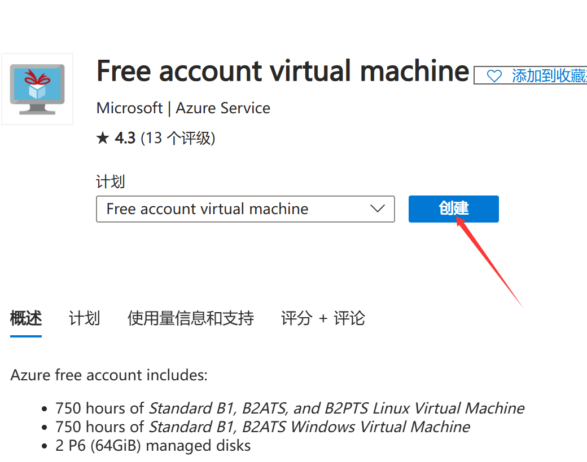
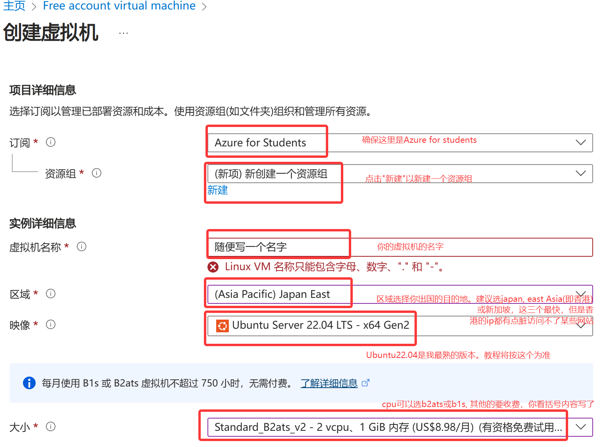
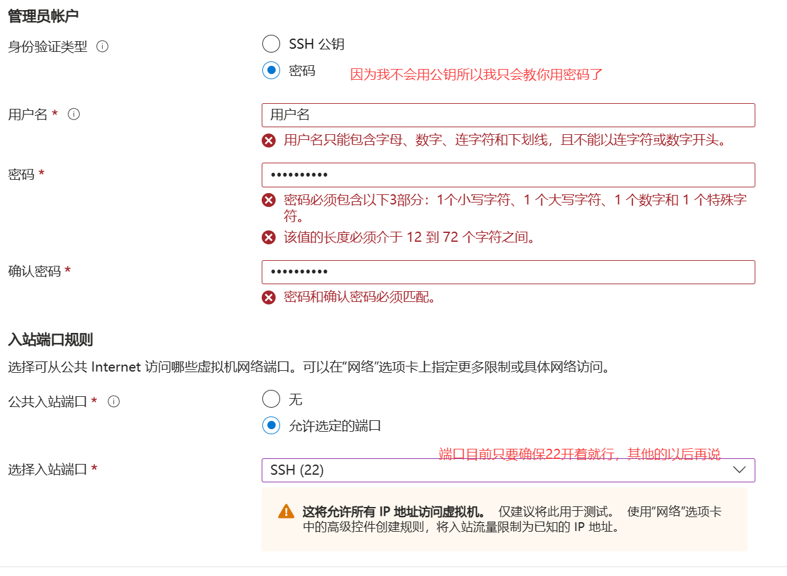
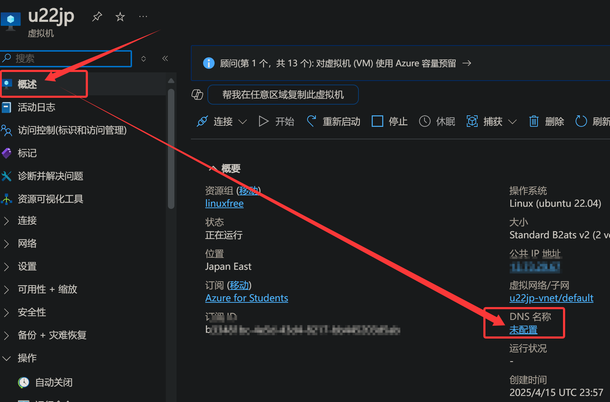
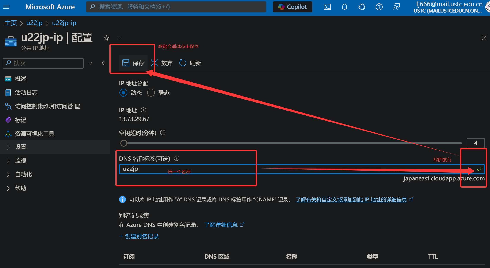
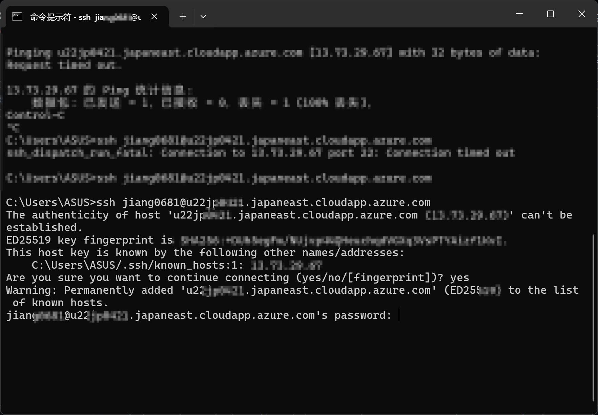

# (Linux篇)申请 Azure for Students

并获取多年免费 VPS 并搭建访外线路。

如果你有一个 .edu 或 .edu.cn 邮箱为何不试一试呢。

## 1. 访问 Azure Students

点击 "免费开始使用" ，一步一步按照指引填写你的学校邮箱即可。

参考文章：[Azure 学生账号申请教程](https://zhuanlan.zhihu.com/p/629311513)

## 2. 创建免费 Linux 虚拟机

访问连接：[Create Free Linux VM](https://portal.azure.com/#create/microsoft.freeaccountvirtualmachine-linux)

直接点 "创建"。


按照图示填写虚拟机信息，


点击 "查看+创建"即可。


## 3. 连接到你的虚拟机

访问 Azure 虚拟机面板：[https://portal.azure.com/#browse/Microsoft.Compute%2FVirtualMachines](https://portal.azure.com/#browse/Microsoft.Compute%2FVirtualMachines)

如果没有域名，可以创建 DNS 配置，使用 DNS 地址代替 IP 地址。


点击配置后可以自选一个域名来代替你的公共ip：

回到本机，打开 CMD ，输入

```sh
ssh 用户名@DNS地址
```

然后输入你的密码就好，没有回显，放心输入后回车即可。

如果未安装 SSH 请先安装 SSH。

## 4. 安装 Xray + Nginx + Certbot (推荐配置)

### 4.0 更新程序包

```sh
sudo apt update     # 更新软件列表
sudo apt upgrade    # 升级已安装的软件
```

### 4.1 安装 Xray

参考官方文档：[https://xtls.github.io/document/install.html](https://xtls.github.io/document/install.html)

安装命令：

```sh
sudo bash -c "$(curl -L https://github.com/XTLS/Xray-install/raw/main/install-release.sh)" @ install -u root
```

Xray 的配置文件默认位置：

```text
/usr/local/etc/xray/config.json
```

**配置示例**(请使用自己生成的 UUID 和域名，删除此处示例中的真实数据)：

```json
{
  "log": {
    "loglevel": "warning"
  },
  "inbounds": [
    {
      "port": 3001,
      "listen": "127.0.0.1",
      "protocol": "vless",
      "settings": {
        "clients": [
          {"id": "<uuid-vless>"}
        ],
        "decryption": "none"
      },
      "streamSettings": {
        "network": "ws",
        "wsSettings": {
          "path": "/vlessws"
        }
      }
    },
    {
      "port": 3002,
      "listen": "127.0.0.1",
      "protocol": "trojan",
      "settings": {
        "clients": [
          {"password": "<uuid-trojan>"}
        ]
      },
      "streamSettings": {
        "network": "ws",
        "wsSettings": {
          "path": "/trojanws"
        }
      }
    },
    {
      "listen": "0.0.0.0",
      "port": 51410,
      "protocol": "trojan",
      "settings": {
        "clients": [
          {"password": "<uuid-cert>", "level": 0}
        ]
      },
      "streamSettings": {
        "network": "tcp",
        "security": "tls",
        "tlsSettings": {
          "certificates": [
            {
              "certificateFile": "/etc/letsencrypt/live/<your-domain>/fullchain.pem",
              "keyFile": "/etc/letsencrypt/live/<your-domain>/privkey.pem"
            }
          ]
        },
        "tcpSettings": {
          "acceptProxyProtocol": false
        }
      },
      "sniffing": {
        "enabled": true,
        "destOverride": ["http", "tls"]
      }
    }
  ],
  "outbounds": [{"protocol": "freedom"}]
}
```

**注意**：Xray 的 config.json 不支持注释，请在食用的时候删除所有注释。

`<uuid-vless>` `<uuid-trojan>` `<uuid-cert>`这些可以使用xray的uuid随机生成小工具随机生成：
```sh
xray uuid
```
这样破解密码和隧道的难度大大增加，数据不再裸奔。这些数据你得记住。
`<your-domain>`替换为你的域名，前面有说。
### 4.2 安装 Nginx

```sh
sudo apt install nginx
```

配置 nginx.conf ：

```conf
http {
    include /etc/nginx/conf.d/*.conf;
    # ... 其他配置
}
```

在 `/etc/nginx/conf.d/` 新建 `xray.conf`：

```conf
server {
    listen 80;
    listen 443 ssl http2;
    server_name <your-domain>;

    # 这里写你证书所在位置。可以先不写，因为还没配置Certbot为你申请的ssl证书。
    # ssl_certificate /etc/letsencrypt/live/<your-domain>/fullchain.pem;
    # ssl_certificate_key /etc/letsencrypt/live/<your-domain>/privkey.pem;

    location / {
        root /var/www/html;
        index index.html;
    }

    location /vlessws {
        proxy_pass http://127.0.0.1:3001;
        proxy_http_version 1.1;
        proxy_set_header Upgrade $http_upgrade;
        proxy_set_header Connection "upgrade";
        proxy_set_header Host $host;
    }

    location /trojanws {
        proxy_pass http://127.0.0.1:3002;
        proxy_http_version 1.1;
        proxy_set_header Upgrade $http_upgrade;
        proxy_set_header Connection "upgrade";
        proxy_set_header Host $host;
    }
}
```

### 4.3 安装 Certbot
cetbot负责为你的域名申请ssl证书。如果没有证书你的vps只能用sw协议传输数据，几乎等于明文所以安全性不能保证。Trojan和Vless等协议都需要对应域名的ssl证书。这个和网站的https的访问所用到的ssl证书是一个东西。

以下是在 Ubuntu + Nginx 环境下，使用 Certbot 安装并申请 Let's Encrypt 免费 SSL 证书 的完整流程。

**一、前提条件**
Ubuntu 已安装好 Nginx 并运行。

你拥有一个已解析到这台服务器公网 IP 的域名（如 example.com）。

可在自己的电脑上用命令检查：

```bash
ping example.com
```
**二、安装 Certbot 和 Nginx 插件**
```bash
sudo apt update
sudo apt install certbot python3-certbot-nginx -y
```
**三、使用 Certbot 自动为 Nginx 配置 HTTPS**

Certbot 会自动识别 Nginx 配置并签发证书：

```bash
sudo certbot --nginx
```
安装过程中会提示你：

输入邮箱（用于续期通知）。

是否同意服务条款（选 A 同意）。

是否强制跳转到 HTTPS（建议选 2）。

**四、申请成功后，访问验证**
申请成功后，Certbot 会自动修改你的 Nginx 配置，开启 443 端口，并启用 HTTPS。

你现在可以访问:https://example.com

验证是否有绿锁图标和有效证书。

有可能你需要重启一次nginx.

**五、测试自动续期**
Let's Encrypt 证书有效期为 90 天，Certbot 默认每天自动检查是否需要续期。

你可以手动测试自动续期是否成功：

```bash
sudo certbot renew --dry-run
```
不过我建议你证书能用就不要再动，等到了90天再说。并且最近更新了协议，免费证书有效期即将缩短到51天了。所以要时不时检查。
**六、Nginx 默认配置结构示例（含伪装页和其他的子通道配置）**
```conf
server {
    listen 80;
    server_name example.com;
    return 301 https://$host$request_uri;
}

server {
    listen 443 ssl;
    server_name example.com;

    # 这里配置ssl证书位置
    ssl_certificate /etc/letsencrypt/live/example.com/fullchain.pem;
    ssl_certificate_key /etc/letsencrypt/live/example.com/privkey.pem;

    location / {
        root /var/www/html;
        index index.html index.htm;
    }
    # 其他location, 如vless和Trojan的入口，前面已有配置可以参考。
}
```
这里注意，`/var/www/html`是你网站文件的所在位置，主页一般是`index.html`文件。如果你没有记得放点东西进去，比如可以问ai要一个简单的html网页, 改名为index.html放进去就行了。

example.com记得替换为你自己的。

### 如果顺利你的vps就已经部署好了。接下来教你怎么食用。
## 4.4 Clash配置
这里提供一个我用的配置。有不懂的问ai吧。
```yaml
port: 7890
socks-port: 7891
mixed-port: 7893
allow-lan: false
mode: rule
log-level: info
external-controller: 127.0.0.1:9090
secret: ""

dns:
  enable: true # 有时候如果找不到dns可以设为false
  ipv6: false
  listen: 0.0.0.0:53
  enhanced-mode: fake-ip
  nameserver:
    - 8.8.8.8
    - 1.1.1.1
  fallback:
    - tls://dns.google
    - tls://1.1.1.1

proxies:
  - name: "🇯🇵-VLESS-WS-TLS"
    type: vless
    server: <your-domain>
    port: 443
    uuid: <uuid-vless>
    tls: true
    udp: true
    servername: <your-domain>
    skip-cert-verify: false
    network: ws
    ws-opts:
      path: /vlessws
      headers:
        Host: <your-domain>
    client-fingerprint: chrome

  - name: "🇯🇵-Trojan-WS-TLS"
    type: trojan
    server: <>
    port: 443
    password: <uuid-trojan>
    udp: true
    sni: <your-domain>
    skip-cert-verify: false
    network: ws
    ws-opts:
      path: /trojanws
      headers:
        Host: <your-domain>
    client-fingerprint: chrome

  - name: "🇯🇵-Trojan-TCP"
    type: trojan
    server: <your-domain>
    port: 51410
    password: <uuid-cert>
    sni: <your-domain>

proxy-groups:
  - name: "规则选择"
    type: select
    proxies:
      - 🇯🇵-VLESS-WS-TLS
      - 🇯🇵-Trojan-WS-TLS
      - 🇯🇵-Trojan-TCP
      - DIRECT
```
clash for windows可以用上面三个和更多的;
clash for Android不能使用Vless;
ios的specre只能用传统Trojan, 除非买其他软件不然其他的协议都不支持。
然后在配置文件里加点rules，直接加在这个配置文件后面就行，这个可能每个人的rules都不一样你可以看着改。

rules可以非常长所以我放最后了。

贴一份我的rules配置：
```yaml
rules:
    - 'DOMAIN,skyapi.fatcatcf.com,DIRECT'
    - 'DOMAIN-SUFFIX,services.googleapis.cn,规则选择'
    - 'DOMAIN-SUFFIX,xn--ngstr-lra8j.com,规则选择'
    - 'DOMAIN,safebrowsing.urlsec.qq.com,DIRECT'
    - 'DOMAIN,safebrowsing.googleapis.com,DIRECT'
    - 'DOMAIN,developer.apple.com,规则选择'
    - 'DOMAIN-SUFFIX,digicert.com,规则选择'
    - 'DOMAIN,ocsp.apple.com,规则选择'
    - 'DOMAIN,ocsp.comodoca.com,规则选择'
    - 'DOMAIN,ocsp.usertrust.com,规则选择'
    - 'DOMAIN,ocsp.sectigo.com,规则选择'
    - 'DOMAIN,ocsp.verisign.net,规则选择'
    - 'DOMAIN-SUFFIX,apple-dns.net,规则选择'
    - 'DOMAIN,testflight.apple.com,规则选择'
    - 'DOMAIN,sandbox.itunes.apple.com,规则选择'
    - 'DOMAIN,itunes.apple.com,规则选择'
    - 'DOMAIN-SUFFIX,apps.apple.com,规则选择'
    - 'DOMAIN-SUFFIX,blobstore.apple.com,规则选择'
    - 'DOMAIN,cvws.icloud-content.com,规则选择'
    - 'DOMAIN-SUFFIX,mzstatic.com,DIRECT'
    - 'DOMAIN-SUFFIX,itunes.apple.com,DIRECT'
    - 'DOMAIN-SUFFIX,icloud.com,DIRECT'
    - 'DOMAIN-SUFFIX,icloud-content.com,DIRECT'
    - 'DOMAIN-SUFFIX,me.com,DIRECT'
    - 'DOMAIN-SUFFIX,aaplimg.com,DIRECT'
    - 'DOMAIN-SUFFIX,cdn20.com,DIRECT'
    - 'DOMAIN-SUFFIX,cdn-apple.com,DIRECT'
    - 'DOMAIN-SUFFIX,akadns.net,DIRECT'
    - 'DOMAIN-SUFFIX,akamaiedge.net,DIRECT'
    - 'DOMAIN-SUFFIX,edgekey.net,DIRECT'
    - 'DOMAIN-SUFFIX,mwcloudcdn.com,DIRECT'
    - 'DOMAIN-SUFFIX,mwcname.com,DIRECT'
    - 'DOMAIN-SUFFIX,apple.com,DIRECT'
    - 'DOMAIN-SUFFIX,apple-cloudkit.com,DIRECT'
    - 'DOMAIN-SUFFIX,apple-mapkit.com,DIRECT'
    - 'DOMAIN-SUFFIX,126.com,DIRECT'
    - 'DOMAIN-SUFFIX,126.net,DIRECT'
    - 'DOMAIN-SUFFIX,127.net,DIRECT'
    - 'DOMAIN-SUFFIX,163.com,DIRECT'
    - 'DOMAIN-SUFFIX,360buyimg.com,DIRECT'
    - 'DOMAIN-SUFFIX,36kr.com,DIRECT'
    - 'DOMAIN-SUFFIX,acfun.tv,DIRECT'
    - 'DOMAIN-SUFFIX,air-matters.com,DIRECT'
    - 'DOMAIN-SUFFIX,aixifan.com,DIRECT'
    - 'DOMAIN-KEYWORD,alicdn,DIRECT'
    - 'DOMAIN-KEYWORD,alipay,DIRECT'
    - 'DOMAIN-KEYWORD,taobao,DIRECT'
    - 'DOMAIN-SUFFIX,amap.com,DIRECT'
    - 'DOMAIN-SUFFIX,autonavi.com,DIRECT'
    - 'DOMAIN-KEYWORD,baidu,DIRECT'
    - 'DOMAIN-SUFFIX,bdimg.com,DIRECT'
    - 'DOMAIN-SUFFIX,bdstatic.com,DIRECT'
    - 'DOMAIN-SUFFIX,bilibili.com,DIRECT'
    - 'DOMAIN-SUFFIX,bilivideo.com,DIRECT'
    - 'DOMAIN-SUFFIX,caiyunapp.com,DIRECT'
    - 'DOMAIN-SUFFIX,clouddn.com,DIRECT'
    - 'DOMAIN-SUFFIX,cnbeta.com,DIRECT'
    - 'DOMAIN-SUFFIX,cnbetacdn.com,DIRECT'
    - 'DOMAIN-SUFFIX,cootekservice.com,DIRECT'
    - 'DOMAIN-SUFFIX,csdn.net,DIRECT'
    - 'DOMAIN-SUFFIX,ctrip.com,DIRECT'
    - 'DOMAIN-SUFFIX,dgtle.com,DIRECT'
    - 'DOMAIN-SUFFIX,dianping.com,DIRECT'
    - 'DOMAIN-SUFFIX,douban.com,DIRECT'
    - 'DOMAIN-SUFFIX,doubanio.com,DIRECT'
    - 'DOMAIN-SUFFIX,duokan.com,DIRECT'
    - 'DOMAIN-SUFFIX,easou.com,DIRECT'
    - 'DOMAIN-SUFFIX,ele.me,DIRECT'
    - 'DOMAIN-SUFFIX,feng.com,DIRECT'
    - 'DOMAIN-SUFFIX,fir.im,DIRECT'
    - 'DOMAIN-SUFFIX,frdic.com,DIRECT'
    - 'DOMAIN-SUFFIX,g-cores.com,DIRECT'
    - 'DOMAIN-SUFFIX,godic.net,DIRECT'
    - 'DOMAIN-SUFFIX,gtimg.com,DIRECT'
    - 'DOMAIN,cdn.hockeyapp.net,DIRECT'
    - 'DOMAIN-SUFFIX,hongxiu.com,DIRECT'
    - 'DOMAIN-SUFFIX,hxcdn.net,DIRECT'
    - 'DOMAIN-SUFFIX,iciba.com,DIRECT'
    - 'DOMAIN-SUFFIX,ifeng.com,DIRECT'
    - 'DOMAIN-SUFFIX,ifengimg.com,DIRECT'
    - 'DOMAIN-SUFFIX,ipip.net,DIRECT'
    - 'DOMAIN-SUFFIX,iqiyi.com,DIRECT'
    - 'DOMAIN-SUFFIX,jd.com,DIRECT'
    - 'DOMAIN-SUFFIX,jianshu.com,DIRECT'
    - 'DOMAIN-SUFFIX,knewone.com,DIRECT'
    - 'DOMAIN-SUFFIX,le.com,DIRECT'
    - 'DOMAIN-SUFFIX,lecloud.com,DIRECT'
    - 'DOMAIN-SUFFIX,lemicp.com,DIRECT'
    - 'DOMAIN-SUFFIX,licdn.com,DIRECT'
    - 'DOMAIN-SUFFIX,luoo.net,DIRECT'
    - 'DOMAIN-SUFFIX,meituan.com,DIRECT'
    - 'DOMAIN-SUFFIX,meituan.net,DIRECT'
    - 'DOMAIN-SUFFIX,mi.com,DIRECT'
    - 'DOMAIN-SUFFIX,miaopai.com,DIRECT'
    - 'DOMAIN-SUFFIX,microsoft.com,DIRECT'
    - 'DOMAIN-SUFFIX,microsoftonline.com,DIRECT'
    - 'DOMAIN-SUFFIX,miui.com,DIRECT'
    - 'DOMAIN-SUFFIX,miwifi.com,DIRECT'
    - 'DOMAIN-SUFFIX,mob.com,DIRECT'
    - 'DOMAIN-SUFFIX,netease.com,DIRECT'
    - 'DOMAIN-SUFFIX,office.com,DIRECT'
    - 'DOMAIN-SUFFIX,office365.com,DIRECT'
    - 'DOMAIN-KEYWORD,officecdn,DIRECT'
    - 'DOMAIN-SUFFIX,oschina.net,DIRECT'
    - 'DOMAIN-SUFFIX,ppsimg.com,DIRECT'
    - 'DOMAIN-SUFFIX,pstatp.com,DIRECT'
    - 'DOMAIN-SUFFIX,qcloud.com,DIRECT'
    - 'DOMAIN-SUFFIX,qdaily.com,DIRECT'
    - 'DOMAIN-SUFFIX,qdmm.com,DIRECT'
    - 'DOMAIN-SUFFIX,qhimg.com,DIRECT'
    - 'DOMAIN-SUFFIX,qhres.com,DIRECT'
    - 'DOMAIN-SUFFIX,qidian.com,DIRECT'
    - 'DOMAIN-SUFFIX,qihucdn.com,DIRECT'
    - 'DOMAIN-SUFFIX,qiniu.com,DIRECT'
    - 'DOMAIN-SUFFIX,qiniucdn.com,DIRECT'
    - 'DOMAIN-SUFFIX,qiyipic.com,DIRECT'
    - 'DOMAIN-SUFFIX,qq.com,DIRECT'
    - 'DOMAIN-SUFFIX,qqurl.com,DIRECT'
    - 'DOMAIN-SUFFIX,rarbg.to,DIRECT'
    - 'DOMAIN-SUFFIX,ruguoapp.com,DIRECT'
    - 'DOMAIN-SUFFIX,segmentfault.com,DIRECT'
    - 'DOMAIN-SUFFIX,sinaapp.com,DIRECT'
    - 'DOMAIN-SUFFIX,smzdm.com,DIRECT'
    - 'DOMAIN-SUFFIX,snapdrop.net,DIRECT'
    - 'DOMAIN-SUFFIX,sogou.com,DIRECT'
    - 'DOMAIN-SUFFIX,sogoucdn.com,DIRECT'
    - 'DOMAIN-SUFFIX,sohu.com,DIRECT'
    - 'DOMAIN-SUFFIX,soku.com,DIRECT'
    - 'DOMAIN-SUFFIX,speedtest.net,DIRECT'
    - 'DOMAIN-SUFFIX,sspai.com,DIRECT'
    - 'DOMAIN-SUFFIX,suning.com,DIRECT'
    - 'DOMAIN-SUFFIX,taobao.com,DIRECT'
    - 'DOMAIN-SUFFIX,tencent.com,DIRECT'
    - 'DOMAIN-SUFFIX,tenpay.com,DIRECT'
    - 'DOMAIN-SUFFIX,tianyancha.com,DIRECT'
    - 'DOMAIN-SUFFIX,tmall.com,DIRECT'
    - 'DOMAIN-SUFFIX,tudou.com,DIRECT'
    - 'DOMAIN-SUFFIX,umetrip.com,DIRECT'
    - 'DOMAIN-SUFFIX,upaiyun.com,DIRECT'
    - 'DOMAIN-SUFFIX,upyun.com,DIRECT'
    - 'DOMAIN-SUFFIX,veryzhun.com,DIRECT'
    - 'DOMAIN-SUFFIX,weather.com,DIRECT'
    - 'DOMAIN-SUFFIX,weibo.com,DIRECT'
    - 'DOMAIN-SUFFIX,xiami.com,DIRECT'
    - 'DOMAIN-SUFFIX,xiami.net,DIRECT'
    - 'DOMAIN-SUFFIX,xiaomicp.com,DIRECT'
    - 'DOMAIN-SUFFIX,ximalaya.com,DIRECT'
    - 'DOMAIN-SUFFIX,xmcdn.com,DIRECT'
    - 'DOMAIN-SUFFIX,xunlei.com,DIRECT'
    - 'DOMAIN-SUFFIX,yhd.com,DIRECT'
    - 'DOMAIN-SUFFIX,yihaodianimg.com,DIRECT'
    - 'DOMAIN-SUFFIX,yinxiang.com,DIRECT'
    - 'DOMAIN-SUFFIX,ykimg.com,DIRECT'
    - 'DOMAIN-SUFFIX,youdao.com,DIRECT'
    - 'DOMAIN-SUFFIX,youku.com,DIRECT'
    - 'DOMAIN-SUFFIX,zealer.com,DIRECT'
    - 'DOMAIN-SUFFIX,zhihu.com,DIRECT'
    - 'DOMAIN-SUFFIX,zhimg.com,DIRECT'
    - 'DOMAIN-SUFFIX,zimuzu.tv,DIRECT'
    - 'DOMAIN-SUFFIX,zoho.com,DIRECT'
    - 'DOMAIN-KEYWORD,amazon,规则选择'
    - 'DOMAIN-KEYWORD,google,规则选择'
    - 'DOMAIN-KEYWORD,gmail,规则选择'
    - 'DOMAIN-KEYWORD,youtube,规则选择'
    - 'DOMAIN-KEYWORD,facebook,规则选择'
    - 'DOMAIN-SUFFIX,fb.me,规则选择'
    - 'DOMAIN-SUFFIX,fbcdn.net,规则选择'
    - 'DOMAIN-KEYWORD,twitter,规则选择'
    - 'DOMAIN-KEYWORD,instagram,规则选择'
    - 'DOMAIN-KEYWORD,dropbox,规则选择'
    - 'DOMAIN-SUFFIX,twimg.com,规则选择'
    - 'DOMAIN-KEYWORD,blogspot,规则选择'
    - 'DOMAIN-SUFFIX,youtu.be,规则选择'
    - 'DOMAIN-KEYWORD,whatsapp,规则选择'
    - 'DOMAIN-KEYWORD,admarvel,REJECT'
    - 'DOMAIN-KEYWORD,admaster,REJECT'
    - 'DOMAIN-KEYWORD,adsage,REJECT'
    - 'DOMAIN-KEYWORD,adsmogo,REJECT'
    - 'DOMAIN-KEYWORD,adsrvmedia,REJECT'
    - 'DOMAIN-KEYWORD,adwords,REJECT'
    - 'DOMAIN-KEYWORD,adservice,REJECT'
    - 'DOMAIN-SUFFIX,appsflyer.com,REJECT'
    - 'DOMAIN-KEYWORD,domob,REJECT'
    - 'DOMAIN-SUFFIX,doubleclick.net,REJECT'
    - 'DOMAIN-KEYWORD,duomeng,REJECT'
    - 'DOMAIN-KEYWORD,dwtrack,REJECT'
    - 'DOMAIN-KEYWORD,guanggao,REJECT'
    - 'DOMAIN-KEYWORD,lianmeng,REJECT'
    - 'DOMAIN-SUFFIX,mmstat.com,REJECT'
    - 'DOMAIN-KEYWORD,mopub,REJECT'
    - 'DOMAIN-KEYWORD,omgmta,REJECT'
    - 'DOMAIN-KEYWORD,openx,REJECT'
    - 'DOMAIN-KEYWORD,partnerad,REJECT'
    - 'DOMAIN-KEYWORD,pingfore,REJECT'
    - 'DOMAIN-KEYWORD,supersonicads,REJECT'
    - 'DOMAIN-KEYWORD,uedas,REJECT'
    - 'DOMAIN-KEYWORD,umeng,REJECT'
    - 'DOMAIN-KEYWORD,usage,REJECT'
    - 'DOMAIN-SUFFIX,vungle.com,REJECT'
    - 'DOMAIN-KEYWORD,wlmonitor,REJECT'
    - 'DOMAIN-KEYWORD,zjtoolbar,REJECT'
    - 'DOMAIN-SUFFIX,9to5mac.com,规则选择'
    - 'DOMAIN-SUFFIX,abpchina.org,规则选择'
    - 'DOMAIN-SUFFIX,adblockplus.org,规则选择'
    - 'DOMAIN-SUFFIX,adobe.com,规则选择'
    - 'DOMAIN-SUFFIX,akamaized.net,规则选择'
    - 'DOMAIN-SUFFIX,alfredapp.com,规则选择'
    - 'DOMAIN-SUFFIX,amplitude.com,规则选择'
    - 'DOMAIN-SUFFIX,ampproject.org,规则选择'
    - 'DOMAIN-SUFFIX,android.com,规则选择'
    - 'DOMAIN-SUFFIX,angularjs.org,规则选择'
    - 'DOMAIN-SUFFIX,aolcdn.com,规则选择'
    - 'DOMAIN-SUFFIX,apkpure.com,规则选择'
    - 'DOMAIN-SUFFIX,appledaily.com,规则选择'
    - 'DOMAIN-SUFFIX,appshopper.com,规则选择'
    - 'DOMAIN-SUFFIX,appspot.com,规则选择'
    - 'DOMAIN-SUFFIX,arcgis.com,规则选择'
    - 'DOMAIN-SUFFIX,archive.org,规则选择'
    - 'DOMAIN-SUFFIX,armorgames.com,规则选择'
    - 'DOMAIN-SUFFIX,aspnetcdn.com,规则选择'
    - 'DOMAIN-SUFFIX,att.com,规则选择'
    - 'DOMAIN-SUFFIX,awsstatic.com,规则选择'
    - 'DOMAIN-SUFFIX,azureedge.net,规则选择'
    - 'DOMAIN-SUFFIX,azurewebsites.net,规则选择'
    - 'DOMAIN-SUFFIX,bing.com,规则选择'
    - 'DOMAIN-SUFFIX,bintray.com,规则选择'
    - 'DOMAIN-SUFFIX,bit.com,规则选择'
    - 'DOMAIN-SUFFIX,bit.ly,规则选择'
    - 'DOMAIN-SUFFIX,bitbucket.org,规则选择'
    - 'DOMAIN-SUFFIX,bjango.com,规则选择'
    - 'DOMAIN-SUFFIX,bkrtx.com,规则选择'
    - 'DOMAIN-SUFFIX,blog.com,规则选择'
    - 'DOMAIN-SUFFIX,blogcdn.com,规则选择'
    - 'DOMAIN-SUFFIX,blogger.com,规则选择'
    - 'DOMAIN-SUFFIX,blogsmithmedia.com,规则选择'
    - 'DOMAIN-SUFFIX,blogspot.com,规则选择'
    - 'DOMAIN-SUFFIX,blogspot.hk,规则选择'
    - 'DOMAIN-SUFFIX,bloomberg.com,规则选择'
    - 'DOMAIN-SUFFIX,box.com,规则选择'
    - 'DOMAIN-SUFFIX,box.net,规则选择'
    - 'DOMAIN-SUFFIX,cachefly.net,规则选择'
    - 'DOMAIN-SUFFIX,chromium.org,规则选择'
    - 'DOMAIN-SUFFIX,cl.ly,规则选择'
    - 'DOMAIN-SUFFIX,cloudflare.com,规则选择'
    - 'DOMAIN-SUFFIX,cloudfront.net,规则选择'
    - 'DOMAIN-SUFFIX,cloudmagic.com,规则选择'
    - 'DOMAIN-SUFFIX,cmail19.com,规则选择'
    - 'DOMAIN-SUFFIX,cnet.com,规则选择'
    - 'DOMAIN-SUFFIX,cocoapods.org,规则选择'
    - 'DOMAIN-SUFFIX,comodoca.com,规则选择'
    - 'DOMAIN-SUFFIX,crashlytics.com,规则选择'
    - 'DOMAIN-SUFFIX,culturedcode.com,规则选择'
    - 'DOMAIN-SUFFIX,d.pr,规则选择'
    - 'DOMAIN-SUFFIX,danilo.to,规则选择'
    - 'DOMAIN-SUFFIX,dayone.me,规则选择'
    - 'DOMAIN-SUFFIX,db.tt,规则选择'
    - 'DOMAIN-SUFFIX,deskconnect.com,规则选择'
    - 'DOMAIN-SUFFIX,disq.us,规则选择'
    - 'DOMAIN-SUFFIX,disqus.com,规则选择'
    - 'DOMAIN-SUFFIX,disquscdn.com,规则选择'
    - 'DOMAIN-SUFFIX,dnsimple.com,规则选择'
    - 'DOMAIN-SUFFIX,docker.com,规则选择'
    - 'DOMAIN-SUFFIX,dribbble.com,规则选择'
    - 'DOMAIN-SUFFIX,droplr.com,规则选择'
    - 'DOMAIN-SUFFIX,duckduckgo.com,规则选择'
    - 'DOMAIN-SUFFIX,dueapp.com,规则选择'
    - 'DOMAIN-SUFFIX,dytt8.net,规则选择'
    - 'DOMAIN-SUFFIX,edgecastcdn.net,规则选择'
    - 'DOMAIN-SUFFIX,edgekey.net,规则选择'
    - 'DOMAIN-SUFFIX,edgesuite.net,规则选择'
    - 'DOMAIN-SUFFIX,engadget.com,规则选择'
    - 'DOMAIN-SUFFIX,entrust.net,规则选择'
    - 'DOMAIN-SUFFIX,eurekavpt.com,规则选择'
    - 'DOMAIN-SUFFIX,evernote.com,规则选择'
    - 'DOMAIN-SUFFIX,fabric.io,规则选择'
    - 'DOMAIN-SUFFIX,fast.com,规则选择'
    - 'DOMAIN-SUFFIX,fastly.net,规则选择'
    - 'DOMAIN-SUFFIX,fc2.com,规则选择'
    - 'DOMAIN-SUFFIX,feedburner.com,规则选择'
    - 'DOMAIN-SUFFIX,feedly.com,规则选择'
    - 'DOMAIN-SUFFIX,feedsportal.com,规则选择'
    - 'DOMAIN-SUFFIX,fiftythree.com,规则选择'
    - 'DOMAIN-SUFFIX,firebaseio.com,规则选择'
    - 'DOMAIN-SUFFIX,flexibits.com,规则选择'
    - 'DOMAIN-SUFFIX,flickr.com,规则选择'
    - 'DOMAIN-SUFFIX,flipboard.com,规则选择'
    - 'DOMAIN-SUFFIX,g.co,规则选择'
    - 'DOMAIN-SUFFIX,gabia.net,规则选择'
    - 'DOMAIN-SUFFIX,geni.us,规则选择'
    - 'DOMAIN-SUFFIX,gfx.ms,规则选择'
    - 'DOMAIN-SUFFIX,ggpht.com,规则选择'
    - 'DOMAIN-SUFFIX,ghostnoteapp.com,规则选择'
    - 'DOMAIN-SUFFIX,git.io,规则选择'
    - 'DOMAIN-KEYWORD,github,规则选择'
    - 'DOMAIN-SUFFIX,globalsign.com,规则选择'
    - 'DOMAIN-SUFFIX,gmodules.com,规则选择'
    - 'DOMAIN-SUFFIX,godaddy.com,规则选择'
    - 'DOMAIN-SUFFIX,golang.org,规则选择'
    - 'DOMAIN-SUFFIX,gongm.in,规则选择'
    - 'DOMAIN-SUFFIX,goo.gl,规则选择'
    - 'DOMAIN-SUFFIX,goodreaders.com,规则选择'
    - 'DOMAIN-SUFFIX,goodreads.com,规则选择'
    - 'DOMAIN-SUFFIX,gravatar.com,规则选择'
    - 'DOMAIN-SUFFIX,gstatic.com,规则选择'
    - 'DOMAIN-SUFFIX,gvt0.com,规则选择'
    - 'DOMAIN-SUFFIX,hockeyapp.net,规则选择'
    - 'DOMAIN-SUFFIX,hotmail.com,规则选择'
    - 'DOMAIN-SUFFIX,icons8.com,规则选择'
    - 'DOMAIN-SUFFIX,ifixit.com,规则选择'
    - 'DOMAIN-SUFFIX,ift.tt,规则选择'
    - 'DOMAIN-SUFFIX,ifttt.com,规则选择'
    - 'DOMAIN-SUFFIX,iherb.com,规则选择'
    - 'DOMAIN-SUFFIX,imageshack.us,规则选择'
    - 'DOMAIN-SUFFIX,img.ly,规则选择'
    - 'DOMAIN-SUFFIX,imgur.com,规则选择'
    - 'DOMAIN-SUFFIX,imore.com,规则选择'
    - 'DOMAIN-SUFFIX,instapaper.com,规则选择'
    - 'DOMAIN-SUFFIX,ipn.li,规则选择'
    - 'DOMAIN-SUFFIX,is.gd,规则选择'
    - 'DOMAIN-SUFFIX,issuu.com,规则选择'
    - 'DOMAIN-SUFFIX,itgonglun.com,规则选择'
    - 'DOMAIN-SUFFIX,itun.es,规则选择'
    - 'DOMAIN-SUFFIX,ixquick.com,规则选择'
    - 'DOMAIN-SUFFIX,j.mp,规则选择'
    - 'DOMAIN-SUFFIX,js.revsci.net,规则选择'
    - 'DOMAIN-SUFFIX,jshint.com,规则选择'
    - 'DOMAIN-SUFFIX,jtvnw.net,规则选择'
    - 'DOMAIN-SUFFIX,justgetflux.com,规则选择'
    - 'DOMAIN-SUFFIX,kat.cr,规则选择'
    - 'DOMAIN-SUFFIX,klip.me,规则选择'
    - 'DOMAIN-SUFFIX,libsyn.com,规则选择'
    - 'DOMAIN-SUFFIX,linkedin.com,规则选择'
    - 'DOMAIN-SUFFIX,line-apps.com,规则选择'
    - 'DOMAIN-SUFFIX,linode.com,规则选择'
    - 'DOMAIN-SUFFIX,lithium.com,规则选择'
    - 'DOMAIN-SUFFIX,littlehj.com,规则选择'
    - 'DOMAIN-SUFFIX,live.com,规则选择'
    - 'DOMAIN-SUFFIX,live.net,规则选择'
    - 'DOMAIN-SUFFIX,livefilestore.com,规则选择'
    - 'DOMAIN-SUFFIX,llnwd.net,规则选择'
    - 'DOMAIN-SUFFIX,macid.co,规则选择'
    - 'DOMAIN-SUFFIX,macromedia.com,规则选择'
    - 'DOMAIN-SUFFIX,macrumors.com,规则选择'
    - 'DOMAIN-SUFFIX,mashable.com,规则选择'
    - 'DOMAIN-SUFFIX,mathjax.org,规则选择'
    - 'DOMAIN-SUFFIX,medium.com,规则选择'
    - 'DOMAIN-SUFFIX,mega.co.nz,规则选择'
    - 'DOMAIN-SUFFIX,mega.nz,规则选择'
    - 'DOMAIN-SUFFIX,megaupload.com,规则选择'
    - 'DOMAIN-SUFFIX,microsofttranslator.com,规则选择'
    - 'DOMAIN-SUFFIX,mindnode.com,规则选择'
    - 'DOMAIN-SUFFIX,mobile01.com,规则选择'
    - 'DOMAIN-SUFFIX,modmyi.com,规则选择'
    - 'DOMAIN-SUFFIX,msedge.net,规则选择'
    - 'DOMAIN-SUFFIX,myfontastic.com,规则选择'
    - 'DOMAIN-SUFFIX,name.com,规则选择'
    - 'DOMAIN-SUFFIX,nextmedia.com,规则选择'
    - 'DOMAIN-SUFFIX,nsstatic.net,规则选择'
    - 'DOMAIN-SUFFIX,nssurge.com,规则选择'
    - 'DOMAIN-SUFFIX,nyt.com,规则选择'
    - 'DOMAIN-SUFFIX,nytimes.com,规则选择'
    - 'DOMAIN-SUFFIX,omnigroup.com,规则选择'
    - 'DOMAIN-SUFFIX,onedrive.com,规则选择'
    - 'DOMAIN-SUFFIX,onenote.com,规则选择'
    - 'DOMAIN-SUFFIX,ooyala.com,规则选择'
    - 'DOMAIN-SUFFIX,openvpn.net,规则选择'
    - 'DOMAIN-SUFFIX,openwrt.org,规则选择'
    - 'DOMAIN-SUFFIX,orkut.com,规则选择'
    - 'DOMAIN-SUFFIX,osxdaily.com,规则选择'
    - 'DOMAIN-SUFFIX,outlook.com,规则选择'
    - 'DOMAIN-SUFFIX,ow.ly,规则选择'
    - 'DOMAIN-SUFFIX,paddleapi.com,规则选择'
    - 'DOMAIN-SUFFIX,parallels.com,规则选择'
    - 'DOMAIN-SUFFIX,parse.com,规则选择'
    - 'DOMAIN-SUFFIX,pdfexpert.com,规则选择'
    - 'DOMAIN-SUFFIX,periscope.tv,规则选择'
    - 'DOMAIN-SUFFIX,pinboard.in,规则选择'
    - 'DOMAIN-SUFFIX,pinterest.com,规则选择'
    - 'DOMAIN-SUFFIX,pixelmator.com,规则选择'
    - 'DOMAIN-SUFFIX,pixiv.net,规则选择'
    - 'DOMAIN-SUFFIX,playpcesor.com,规则选择'
    - 'DOMAIN-SUFFIX,playstation.com,规则选择'
    - 'DOMAIN-SUFFIX,playstation.com.hk,规则选择'
    - 'DOMAIN-SUFFIX,playstation.net,规则选择'
    - 'DOMAIN-SUFFIX,playstationnetwork.com,规则选择'
    - 'DOMAIN-SUFFIX,pushwoosh.com,规则选择'
    - 'DOMAIN-SUFFIX,rime.im,规则选择'
    - 'DOMAIN-SUFFIX,servebom.com,规则选择'
    - 'DOMAIN-SUFFIX,sfx.ms,规则选择'
    - 'DOMAIN-SUFFIX,shadowsocks.org,规则选择'
    - 'DOMAIN-SUFFIX,sharethis.com,规则选择'
    - 'DOMAIN-SUFFIX,shazam.com,规则选择'
    - 'DOMAIN-SUFFIX,skype.com,规则选择'
    - 'DOMAIN-SUFFIX,smartdns规则选择.com,规则选择'
    - 'DOMAIN-SUFFIX,smartmailcloud.com,规则选择'
    - 'DOMAIN-SUFFIX,sndcdn.com,规则选择'
    - 'DOMAIN-SUFFIX,sony.com,规则选择'
    - 'DOMAIN-SUFFIX,soundcloud.com,规则选择'
    - 'DOMAIN-SUFFIX,sourceforge.net,规则选择'
    - 'DOMAIN-SUFFIX,spotify.com,规则选择'
    - 'DOMAIN-SUFFIX,squarespace.com,规则选择'
    - 'DOMAIN-SUFFIX,sstatic.net,规则选择'
    - 'DOMAIN-SUFFIX,st.luluku.pw,规则选择'
    - 'DOMAIN-SUFFIX,stackoverflow.com,规则选择'
    - 'DOMAIN-SUFFIX,startpage.com,规则选择'
    - 'DOMAIN-SUFFIX,staticflickr.com,规则选择'
    - 'DOMAIN-SUFFIX,steamcommunity.com,规则选择'
    - 'DOMAIN-SUFFIX,symauth.com,规则选择'
    - 'DOMAIN-SUFFIX,symcb.com,规则选择'
    - 'DOMAIN-SUFFIX,symcd.com,规则选择'
    - 'DOMAIN-SUFFIX,tapbots.com,规则选择'
    - 'DOMAIN-SUFFIX,tapbots.net,规则选择'
    - 'DOMAIN-SUFFIX,tdesktop.com,规则选择'
    - 'DOMAIN-SUFFIX,techcrunch.com,规则选择'
    - 'DOMAIN-SUFFIX,techsmith.com,规则选择'
    - 'DOMAIN-SUFFIX,thepiratebay.org,规则选择'
    - 'DOMAIN-SUFFIX,theverge.com,规则选择'
    - 'DOMAIN-SUFFIX,time.com,规则选择'
    - 'DOMAIN-SUFFIX,timeinc.net,规则选择'
    - 'DOMAIN-SUFFIX,tiny.cc,规则选择'
    - 'DOMAIN-SUFFIX,tinypic.com,规则选择'
    - 'DOMAIN-SUFFIX,tmblr.co,规则选择'
    - 'DOMAIN-SUFFIX,todoist.com,规则选择'
    - 'DOMAIN-SUFFIX,trello.com,规则选择'
    - 'DOMAIN-SUFFIX,trustasiassl.com,规则选择'
    - 'DOMAIN-SUFFIX,tumblr.co,规则选择'
    - 'DOMAIN-SUFFIX,tumblr.com,规则选择'
    - 'DOMAIN-SUFFIX,tweetdeck.com,规则选择'
    - 'DOMAIN-SUFFIX,tweetmarker.net,规则选择'
    - 'DOMAIN-SUFFIX,twitch.tv,规则选择'
    - 'DOMAIN-SUFFIX,txmblr.com,规则选择'
    - 'DOMAIN-SUFFIX,typekit.net,规则选择'
    - 'DOMAIN-SUFFIX,ubertags.com,规则选择'
    - 'DOMAIN-SUFFIX,ublock.org,规则选择'
    - 'DOMAIN-SUFFIX,ubnt.com,规则选择'
    - 'DOMAIN-SUFFIX,ulyssesapp.com,规则选择'
    - 'DOMAIN-SUFFIX,urchin.com,规则选择'
    - 'DOMAIN-SUFFIX,usertrust.com,规则选择'
    - 'DOMAIN-SUFFIX,v.gd,规则选择'
    - 'DOMAIN-SUFFIX,v2ex.com,规则选择'
    - 'DOMAIN-SUFFIX,vimeo.com,规则选择'
    - 'DOMAIN-SUFFIX,vimeocdn.com,规则选择'
    - 'DOMAIN-SUFFIX,vine.co,规则选择'
    - 'DOMAIN-SUFFIX,vivaldi.com,规则选择'
    - 'DOMAIN-SUFFIX,vox-cdn.com,规则选择'
    - 'DOMAIN-SUFFIX,vsco.co,规则选择'
    - 'DOMAIN-SUFFIX,vultr.com,规则选择'
    - 'DOMAIN-SUFFIX,w.org,规则选择'
    - 'DOMAIN-SUFFIX,w3schools.com,规则选择'
    - 'DOMAIN-SUFFIX,webtype.com,规则选择'
    - 'DOMAIN-SUFFIX,wikiwand.com,规则选择'
    - 'DOMAIN-SUFFIX,wikileaks.org,规则选择'
    - 'DOMAIN-SUFFIX,wikimedia.org,规则选择'
    - 'DOMAIN-SUFFIX,wikipedia.com,规则选择'
    - 'DOMAIN-SUFFIX,wikipedia.org,规则选择'
    - 'DOMAIN-SUFFIX,windows.com,规则选择'
    - 'DOMAIN-SUFFIX,windows.net,规则选择'
    - 'DOMAIN-SUFFIX,wire.com,规则选择'
    - 'DOMAIN-SUFFIX,wordpress.com,规则选择'
    - 'DOMAIN-SUFFIX,workflowy.com,规则选择'
    - 'DOMAIN-SUFFIX,wp.com,规则选择'
    - 'DOMAIN-SUFFIX,wsj.com,规则选择'
    - 'DOMAIN-SUFFIX,wsj.net,规则选择'
    - 'DOMAIN-SUFFIX,xda-developers.com,规则选择'
    - 'DOMAIN-SUFFIX,xeeno.com,规则选择'
    - 'DOMAIN-SUFFIX,xiti.com,规则选择'
    - 'DOMAIN-SUFFIX,yahoo.com,规则选择'
    - 'DOMAIN-SUFFIX,yimg.com,规则选择'
    - 'DOMAIN-SUFFIX,ying.com,规则选择'
    - 'DOMAIN-SUFFIX,yoyo.org,规则选择'
    - 'DOMAIN-SUFFIX,ytimg.com,规则选择'
    - 'DOMAIN-SUFFIX,telegra.ph,规则选择'
    - 'DOMAIN-SUFFIX,telegram.org,规则选择'
    - 'DOMAIN,injections.adguard.org,DIRECT'
    - 'DOMAIN,local.adguard.org,DIRECT'
    - 'DOMAIN-SUFFIX,local,DIRECT'
    - 'IP-CIDR,127.0.0.0/8,DIRECT'
    - 'IP-CIDR,172.16.0.0/12,DIRECT'
    - 'IP-CIDR,192.168.0.0/16,DIRECT'
    - 'IP-CIDR,10.0.0.0/8,DIRECT'
    - 'IP-CIDR,17.0.0.0/8,DIRECT'
    - 'IP-CIDR,100.64.0.0/10,DIRECT'
    - 'IP-CIDR,224.0.0.0/4,DIRECT'
    - 'IP-CIDR6,fe80::/10,DIRECT'
    - 'DOMAIN-SUFFIX,cn,DIRECT'
    - 'DOMAIN-KEYWORD,-cn,DIRECT'
    - 'GEOIP,CN,DIRECT'
    - 'MATCH,规则选择'
```
